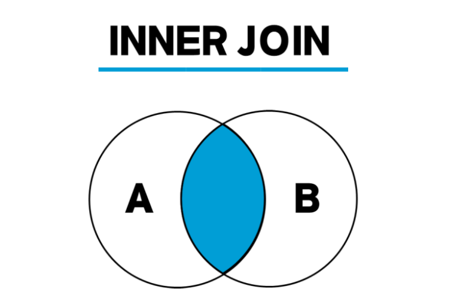

# [CS] Database

# Key

> 검색, 정렬시 튜플(Tuple)을 구분하는 기준이되는 속성(Attribute)
> 

## Key의 종류

### 1) 후보키(**Candidate Key**)

튜플(Tuple)을 유일하게 식별하기 위해 사용하는 속성들의 부분집합으로, 유일성과 최소성을 만족시켜야 함

### 2) 기본키 (**Primary Key**)

후보키 중 선택한 메인키, null 불가, 중복값이 들어갈 수 없음

### 3) 대체키 (**Alternate Key**)

보조키라고도 하며, 후보키 중 기본키를 제외한 나머지 키

### 4) 슈퍼키(Super Key)

유일성은 만족, 최소성은 만족하지 못하는 키

### 5) 외래키 (**Foreign Key**)

다른 릴레이견의 기본키를 그대로 참조하는 속성의 집합

# SQL-JOIN

### JOIN이란?

> 두 개 이상의 테이블이나 데이터베이스를 연결하여 데이터를 검색하는 방법, 테이블을 연결하려면 적어도 하나의 칼럼을 서로 공유하고 있어야 함
> 

## JOIN의 종류

### 1) INNER JOIN

교집합으로, 기준 테이블과 join 테이블의 중복된 값을 보여줌



```sql
SELECT <열 목록>
FROM <첫 번째 테이블>
    INNER JOIN <두 번째 테이블>
    ON <조인 조건>
[WHERE 검색 조건]

#INNER JOIN을 JOIN이라고만 써도 INNER JOIN으로 인식합니다.
```

### 2) OUTER JOIN

내부 조인은 두 테이블에 모두 데이터가 있어야만 결과가 나오지만, 외부 조인은 한쪽에만 데이터가 있어도 결과가 나옴


```sql
SELECT <열 목록>
FROM <첫 번째 테이블(LEFT 테이블)>
    <LEFT | RIGHT | FULL> OUTER JOIN <두 번째 테이블(RIGHT 테이블)>
     ON <조인 조건>
[WHERE 검색 조건]
```

- **LEFT** OUTER JOIN: 왼쪽 테이블의 모든 값이 출력되는 조인
- **RIGHT** OUTER JOIN: 오른쪽 테이블의 모든 값이 출력되는 조인
- **FULL** OUTER JOIN: 왼쪽 또는 오른쪽 테이블의 모든 값이 출력되는 조인

### 5) CROSS JOIN

한쪽 테이블의 모든 행과 다른 쪽 테이블의 모든 행을 조인시키는 기능으로, 상호 조인 결과의 전체 행 개수는 두 테이블의 각 행의 개수를 곱한 수만큼 된다. 이를 **카티션 곱(CARTESIAN PRODUCT)**이라고 한다.


```sql
SELECT *
FROM <첫 번째 테이블>
    CROSS JOIN <두 번째 테이블>
```

### 6) SELF JOIN

자기자신과 자기자신을 조인하는 것으로, 하나의 테이블을 여러번 복사해서 조인한다고 생각하면 편하다. 자신이 갖고 있는 칼럼을 다양하게 변형시켜 활용할 때 자주 사용한다.

```sql
SELECT <열 목록>
FROM <테이블> 별칭A
    INNER JOIN <테이블> 별칭B
[WHERE 검색 조건]
```

# SQL Injection

> 해커에 의해 조작된 SQL 쿼리문이 데이터베이스에 그대로 전달되어 비정상적 명령을 실행시키는 공격 기법
> 

### 인증 우회

admin이라는 id가 존재한다고 가정해보자.

ID : admin

PW : 'or 1=1#

id, password 파라미터에 위와 같이 입력하면

```sql
SELECT * FROM member WHERE id = 'admin' AND pass = ''or 1=1#';
```

이러한 쿼리가 실행되는데, 1=1이 참이기 때문에 이런 쿼리가 된다.

```sql
SELECT * FROM member WHERE id = 'admin' AND true;
```

### 방어 방법

**1) input 값을 받을 때, 특수문자 여부 검사하기**

> 로그인 전, 검증 로직을 추가하여 미리 설정한 특수문자들이 들어왔을 때 요청을 막아낸다. 
특수문자( **' " / \ ; : Space -- + 등**)가 포함되어 있는지 검사하여 허용되지 않은 문자열이나 문자가 포함된 경우에는 에러로 처리한다.
> 

**2) SQL 서버 오류 발생 시, 해당하는 에러 메시지 감추기**

> view를 활용하여 원본 데이터베이스 테이블에는 접근 권한을 높인다. 일반 사용자는 view로만 접근하여 에러를 볼 수 없도록 만든다.
> 

**3) preparestatement 사용하기**

> preparestatement를 사용하면, 특수문자를 자동으로 escaping 해준다. (statement와는 다르게 쿼리문에서 전달인자 값을 ?로 받는 것) 이를 활용해 서버 측에서 필터링 과정을 통해서 공격을 방어한다.
> 

# SQL vs NoSQL

## DataBase

체계화된 데이터의 모임

- 검색, 구조화 같은 작업을 보다 쉽게 하기 위해 조직화된 데이터를 수집하는 저장 시스템

### DBMS(Database Management System)

데이터베이스를 조작하는 프로그램

- 웹개발에서 대부분의 데이터베이스는 관계형 데이터베이스 관리 시스템(RDBMS, Relational Database Management System)을 사용하여 SQL로 데이터와 프로그래밍을 구성함.

### RDBMS

- 관계형 데이터베이스 관리 시스템(Relational Database Management System)
- 관계형 데이터베이스를 만들고 업데이트, 관리하는 데 사용되는 프로그램

---

## RDB(Relational Database)

### 관계형 데이터베이스

- 데이터를 테이블, 행, 열 등으로 나누어 구조화하는 방식
- 자료를 여러 테이블로 나누어 관리하고, 이 테이블 간의 관계를 설정하여 여러 데이터를 쉽게 조작하도록 함
- SQL을 이용해 데이터를 조회 또는 조작할 수 있음

### 관계형 데이터베이스의 장점

- 데이터를 직관적으로 표현 가능
- 관련된 각 데이터에 쉽게 접근 가능
- 대량의 데이터도 효율적으로 관리 가능

## SQL(Structured Query Language)

- RDBMS의 데이터를 관리하기 위해 설계된 특수 목적의 프로그래밍 언어
- 사용자와 관계형 데이터베이스 사이에서, 사용자의 요청을 해석하여 데이터베이스에 저장된 정보를 관리할 수 있도록 해주는 소프트웨어

## 스키마

데이터베이스를 구성하는 개체(Entity), 속성(Attribute), 관계(Relationship) 및 제약조건 등에 관해 전반적으로 정의한 메타데이터의 집합

## NoSQL(Not only SQL)

관계형 데이터베이스와는 반대되는 방식을 사용하며, 데이터 테이블 간의 고나계를 정의하지 않는다. 정해진 스키마가 없어 보다 자유롭게 데이터를 저장할 수 있다. RDBMS 로는 관리할 수 없는 복잡하고 용량이 큰 데이터들을 관리할 수 있도록 하기 위해 등장하였다. key값만 가지고 데이터에 대한 입출력을 수행할 수 있다.

---

### SQL 장점

- 명확하게 정의된 스키마, 데이터 무결성 보장
- 관계는 각 데이터를 중복없이 한번만 저장

### SQL 단점

- 덜 유연함. 데이터 스키마를 사전에 계획하고 알려야 함. (나중에 수정하기 힘듬)
- 관계를 맺고 있어서 조인문이 많은 복잡한 쿼리가 만들어질 수 있음
- 대체로 수직적 확장만 가능함

### NoSQL 장점

- 스키마가 없어서 유연함. 언제든지 저장된 데이터를 조정하고 새로운 필드 추가 가능
- 데이터는 애플리케이션이 필요로 하는 형식으로 저장됨. 데이터 읽어오는 속도 빨라짐
- 수직 및 수평 확장이 가능해서 애플리케이션이 발생시키는 모든 읽기/쓰기 요청 처리 가능

### NoSQL 단점

- 유연성으로 인해 데이터 구조 결정을 미루게 될 수 있음
- 데이터 중복을 계속 업데이트 해야 함
- 데이터가 여러 컬렉션에 중복되어 있기 때문에 수정 시 모든 컬렉션에서 수행해야 함 (SQL에서는 중복 데이터가 없으므로 한번만 수행이 가능)

### SQL 데이터베이스 사용이 더 좋을 때

- 관계를 맺고 있는 데이터가 자주 변경되는 애플리케이션의 경우
    
    > NoSQL에서는 여러 컬렉션을 모두 수정해야 하기 때문에 비효율적
    > 
- 변경될 여지가 없고, 명확한 스키마가 사용자와 데이터에게 중요한 경우

### NoSQL 데이터베이스 사용이 더 좋을 때

- 정확한 데이터 구조를 알 수 없거나 변경/확장 될 수 있는 경우
- 읽기를 자주 하지만, 데이터 변경은 자주 없는 경우
- 데이터베이스를 수평으로 확장해야 하는 경우 (막대한 양의 데이터를 다뤄야 하는 경우)

하나의 제시 방법이지 완전한 정답이 정해져 있는 것은 아니다.

SQL을 선택해서 복잡한 JOIN문을 만들지 않도록 설계하여 단점을 없앨 수도 있고

NoSQL을 선택해서 중복 데이터를 줄이는 방법으로 설계해서 단점을 없앨 수도 있다.

# 정규화**(Normalization)**

테이블 간 **중복 데이터**를 없 **무결성**을 유지하여 DB 저장 용량을 효율적으로 관리하기 위한 과정, 보통 제 3 정규화까지만 진행한다.

- 참고 링크
    
    [https://wkdtjsgur100.github.io/database-normalization/](https://wkdtjsgur100.github.io/database-normalization/)
    

## 제 1 정규화(**First Normal Form, 1NF)**

- 어떤 Relation에 속한 모든 Domain이 원자값(atomic value)만으로 되어 있다.
- 모든 attribute에 반복되는 그룹(repeating group)이 나타나지 않는다.
- 기본 키를 사용하여 관련 데이터의 각 집합을 고유하게 식별할 수 있어야 한다.

## **제 2정규화(Second Normal Form, 2NF)**

테이블의 **모든 컬럼이 완전 함수적 종속을 만족한다.** 부분 함수적 종속을 모두 제거된 상태여야 한다. 보통 테이블 분리를 통해 일어난다.

- 함수적 종속
X의 값에 따라 Y값이 결정될 때 X -> Y로 표현하는데, 이를 Y는 X에 대해 **함수적 종속**
- 함수적 종속에서 X의 값이 여러 요소일 경우, 즉, {X1, X2} -> Y일 경우, X1와 X2가 Y의 값을 결정할 때 이를 **완전 함수적 종속** 이라고 하고, X1, X2 중 하나만 Y의 값을 결정할 때 이를 **부분 함수적 종속** 이라고 한다.

## 제 3**정규화(Third Normal Form, 3NF)**

- Relation이 제 2정규화 되었다.(The relation is in second normal form)
- 기본 키(primary key)가 아닌 속성(Attribute)들은 기본 키에만 의존해야 한다

# 이상(Anomaly)

데이터베이스에서 정규화를 수행하지 않으면, 데이터의 중복이 발생하고 전체적인 무결성이 저하됩니다. 이러한 원인은 데이터 **이상 현상(Anomaly)**에 의해 발생하며, 이상 현상으로 인해  현실세계의 실제 값과 데이터베이스에 저장된 값이 일치하지 않는 문제가 발생합니다.

## 이상(Anomaly) 종류

### 1) ****삽입 이상(Insertion anomaly)****

**삽입 이상**은 특정 데이터가 존재하지 않아 중요한 데이터를 데이터베이스에 삽입할 수 없을 때 발생


### 2) ****삭제 이상(Deletion anomaly)****

**삭제 이상**은 특정 정보를 삭제하면, 원치 않는 정보도 삭제되는 현상


### 3) ****업데이트 이상(Update anomaly)****

테이블의 특정 데이터를 업데이트했는데, 정상적으로 변경되지 않은 경우 그리고 너무 많은 행을 업데이트하는 것을 **업데이트 이상**이라고 한다.


# 인덱스(Index)

> 추가적인 쓰기 작업과 저장 공간을 활용하여 데이터베이스 테이블의 검색 속도를 향상시키기 위한 자료구조이다. 데이터베이스 안의 레코드를 처음부터 풀스캔하지 않고, B+ Tree로 구성된 구조에서 Index 파일 검색으로 속도를 향상시키는 기술이다.
> 

테이블 생성 시, 3가지 파일이 생성된다.

- FRM : 테이블 구조 저장 파일
- MYD : 실제 데이터 파일
- MYI : Index 정보 파일 (Index 사용 시 생성)

사용자가 쿼리를 통해 Index를 사용하는 칼럼을 검색하게 되면, 이때 MYI 파일의 내용을 활용

### Idex의 단점

- Index 생성시, .mdb 파일 크기가 증가한다. **(DB의 10퍼센트 내외의 공간이 추가로 필요)**
- 응용 프로그램에서의 여러 사용자가 **한 페이지를 동시에 수정할 수 있는 병행성**이 줄어든다.
- 인덱스 된 Field에서 Data를 업데이트하거나, **Record를 추가 또는 삭제시 성능이 떨어진다.**
- 데이터 변경 작업이 자주 일어나는 경우, **Index를 재작성**해야 하므로 성능에 영향을 미친다.

### 사용하면 좋은 경우

- Where 절에서 자주 사용되는 Column
- 외래키가 사용되는 Column
- Join에 자주 사용되는 Column

### 사용하면 안 좋은 경우

- Data 중복도가 높은 Column
- DML이 자주 일어나는 Column

### DML이 일어났을 때의 상황

- INSERT
    
    기존 Block에 여유가 없을 때, 새로운 Data가 입력된다면
    
    → 새로운 Block을 할당 받은 후, Key를 옮기는 작업을 수행한다.
    
    → Index split 작업 동안, 해당 Block의 Key 값에 대해서 DML이 블로킹 된다. (대기 이벤트 발생)
    
    → 이때 Block의 논리적인 순서와 물리적인 순서가 달라질 수 있다. (인덱스 조각화)
    
- DELETE
    
    Table에서 data가 delete 되는 경우 : Data가 지워지고, 다른 Data가 그 공간을 사용 가능하다.
    
    Index에서 Data가 delete 되는 경우 : Data가 지워지지 않고, 사용 안 됨 표시만 해둔다.
    
    → **Table의 Data 수와 Index의 Data 수가 다를 수 있음**
    
- UPDATE
    
    Table에서 update가 발생하면 → Index는 update 할 수 없다.
    
    Index에서는 **Delete가 발생한 후, 새로운 작업의 Insert 작업** / 2배의 작업이 소요되어 성능 저하
    

### 인덱스 관리 방식

- B-Tree 자료구조
    
    이진 탐색트리와 유사한 자료구조
    
    - 자식 노드를 둘이상 가질 수 있고 Balanced Tree임
    - So, 탐색 연산에 있어 O(log N)의 시간복잡도를 가짐
    - 모든 노드들에 대해 값을 저장하고 있으며 포인터 역할을 동반함
- B+Tree 자료구조
    
    B-Tree를 개선한 형태의 자료구조
    
    - 값을 리프노드에만 저장하며 리프노드들 끼리는 링크드 리스트로 연결
    - So, 부등호문 연산에 대해 효과적
    - 리프 노드를 제외한 노드들은 포인터의 역할만을 수행
- HashTable 자료구조
    
    해시 함수를 이용해서 값을 인덱스로 변경 하여 관리하는 자료구조
    
    - 일반적인 경우 탐색, 삽입, 삭제 연산에 대해 O(1)의 시간 복잡도를 가짐
    - 최악의 경우 해시 충돌이 발생하는 것으로 탐색, 삽입, 삭제 연산에 대해 O(N)의 시간복잡도를 가짐
    - 값 자체를 변경하기 때문에 부등호문, 포함문등의 연산에 사용할 수 없음

# 트랜잭션(Transaction)

> 데이터베이스의 상태를 변화시키기 위해 수행하는 작업 단위
> 

작업 단위 → **많은 SQL 명령문들을 사람이 정하는 기준에 따라 정하는 것**

예시) 사용자 A가 사용자 B에게 만원을 송금한다.
- 1. 사용자 A의 계좌에서 만원을 차감한다 : UPDATE 문을 사용해 사용자 A의 잔고를 변경
- 2. 사용자 B의 계좌에 만원을 추가한다 : UPDATE 문을 사용해 사용자 B의 잔고를 변경

현재 작업 단위 : 출금 UPDATE문 + 입금 UPDATE문 → 이를 통틀어 하나의 트랜잭션으로 정의하면
- `Commit`: 위 두 쿼리문 모두 성공적으로 완료되어야만 "하나의 작업(트랜잭션)"이 완료되는 것이다. 
- `Rollback`: 작업 단위에 속하는 쿼리 중 하나라도 실패하면 모든 쿼리문을 취소하고 이전 상태로 돌려놓아야한다.

## 트랜잭션의 4가지 특징

### **Atomicity(원자성)**

- 트랜잭션의 연산은 데이터베이스에 모두 반영되든지 아니면 전혀 반영되지 않아야 한다.
- 트랜잭션 내의 모든 명령은 반드시 완벽히 수행되어야 하며, 모두가 완벽히 수행되지 않고 어느하나라도 오류가 발생하면 트랜잭션 전부가 취소되어야 한다.

### **Consistency(일관성)**

- 트랜잭션이 그 실행을 성공적으로 완료하면 언제나 일관성 있는 데이터베이스 상태로 변환한다.
- 시스템이 가지고 있는 고정요소는 트랜잭션 수행 전과 트랜잭션 수행 완료 후의 상태가 같아야 한다.

### **Isolation(독립성,격리성)**

- 둘 이상의 트랜잭션이 동시에 병행 실행되는 경우 어느 하나의 트랜잭션 실행중에 다른 트랜잭션의 연산이 끼어들 수 없다.
- 수행중인 트랜잭션은 완전히 완료될 때까지 다른 트랜잭션에서 수행 결과를 참조할 수 없다.

### **Durablility(영속성,지속성)**

- 성공적으로 완료된 트랜잭션의 결과는 시스템이 고장나더라도 영구적으로 반영되어야 한다.

# 트랜잭션 격리 수준(Transaction Isolation Level)

> 트랜잭션 격리수준(isolation level)이란 동시에 여러 트랜잭션이 처리될 때, 트랜잭션끼리 얼마나 서로 고립되어 있는지를 나타내는 것이다.
> 
> 
> 즉, 간단하게 말해 특정 트랜잭션이 다른 트랜잭션에 변경한 데이터를 볼 수 있도록 허용할지 말지를 결정하는 것이다.
> 

### 필요성

데이터베이스는 ACID 특징과 같이 트랜잭션이 독립적인 수행을 하도록 한다. 트랜잭션이 DB를 다루는 동안 다른 트랜잭션이 관여하지 못하도록 막는 것이 Locking이다. Locking이 무조건적으로 좋은 건 아니다. 데이터베이스 성능과 데이터베이스 일관성을 고려하여 최대한 효율적인 Locking 방법을 채택하는 것이 좋다.

### **Isolation level 종류**

동시성을 증가시키면 데이터 무결성에 문제가 발생하고, 데이터 무결성을 유지하면 동시성이 떨어지게 되고, 레벨을 높게 조정할수록 비용 증가 

1. **Read Uncommitted (레벨 0)**
    
    > SELECT 문장이 수행되는 동안 해당 데이터에 Shared Lock이 걸리지 않는 계층
    > 
    
    트랜잭션에 처리중이거나, 아직 Commit되지 않은 데이터를 다른 트랜잭션이 읽는 것을 허용함
    
    `사용자1이 A라는 데이터를 B라는 데이터로 변경하는 동안 사용자2는 아직 완료되지 않은(Uncommitted) 트랜잭션이지만 데이터B를 읽을 수 있다`
    
    데이터베이스의 일관성을 유지하는 것이 불가능함
    
2. **Read Committed (레벨 1)**
    
    > SELECT 문장이 수행되는 동안 해당 데이터에 Shared Lock이 걸리는 계층
    > 
    
    트랜잭션이 수행되는 동안 다른 트랜잭션이 접근할 수 없어 대기하게 됨
    
    Commit이 이루어진 트랜잭션만 조회 가능
    
    대부분의 SQL 서버가 Default로 사용하는 Isolation Level임
    
    `사용자1이 A라는 데이터를 B라는 데이터로 변경하는 동안 사용자2는 해당 데이터에 접근이 불가능함`
    
3. **Repeatable Read (레벨 2)**
    
    > 트랜잭션이 완료될 때까지 SELECT 문장이 사용하는 모든 데이터에 Shared Lock이 걸리는 계층
    > 
    
    트랜잭션이 범위 내에서 조회한 데이터 내용이 항상 동일함을 보장함
    
    다른 사용자는 트랜잭션 영역에 해당되는 데이터에 대한 수정 불가능
    
    MySQL에서 Default로 사용하는 Isolation Level
    
4. **Serializable (레벨 3)**
    
    > 트랜잭션이 완료될 때까지 SELECT 문장이 사용하는 모든 데이터에 Shared Lock이 걸리는 계층
    > 
    
    완벽한 읽기 일관성 모드를 제공함
    
    다른 사용자는 트랜잭션 영역에 해당되는 데이터에 대한 수정 및 입력 불가능
    

### **낮은 단계 Isolation Level을 활용시 문제점**

- **Dirty Read**
    
    커밋되지 않은 수정중인 데이터를 다른 트랜잭션에서 읽을 수 있도록 허용할 때 발생하는 현상
    
    어떤 트랜잭션에서 아직 실행이 끝나지 않은 다른 트랜잭션에 의한 변경사항을 보게되는 경우
    
    - 발생 Level: Read Uncommitted
- **Non-Repeatable Read**
    
    한 트랜잭션에서 같은 쿼리를 두 번 수행할 때 그 사이에 다른 트랜잭션 값을 수정 또는 삭제하면서 두 쿼리의 결과가 상이하게 나타나는 일관성이 깨진 현상
    
    - 발생 Level: Read Committed, Read Uncommitted
- **Phantom Read**
    
    한 트랜잭션 안에서 일정 범위의 레코드를 두 번 이상 읽었을 때, 첫번째 쿼리에서 없던 레코드가 두번째 쿼리에서 나타나는 현상
    
    트랜잭션 도중 새로운 레코드 삽입을 허용하기 때문에 나타나는 현상임
    
    - 발생 Level: Repeatable Read, Read Committed, Read Uncommitted

# 저장 프로시저(Stored Procedure)

> SQL Server에서 제공되는 프로그래밍 기능. 쿼리문의 집합
> 
> 
> 어떠한 동작을 일괄 처리하기 위한 용도로 사용.
> 
> 자주 사용되는 일반적인 쿼리를 모듈화시켜서 필요할 때마다 호출
> 
> 테이블처럼 각 데이터베이스 내부에 저장
> 

## 저장프로시저의 **장점**

### **SQL Server의 성능을 향상 (최적화 & 캐시)**

- 저장프로시저의 두번째 실행부터는 캐시(메모리)에 있는 것을 가져와서 사용하므로 속도가 빨라진다. 또한, 여러개의 쿼리를 한번에 실행할 수 있다.

### **유지보수 및 재활용성 좋음**

- C#, Java등으로 만들어진 응용프로그램에서 직접 SQL문을 호출하지 않고 저장 프로시저의 이름을 호출하도록 설정하여 사용하는 경우가 많은데, 이때 개발자는 수정요건이 발생할때 코드 내 SQL문을 건드리는게 아니라 **SP 파일만 수정하면 되기** 때문에 유지보수 측면에서 유리해진다.( SP 수정으로 조회, 수정, 추가 등의 가벼운 소스 변경 등이 가능)
- 한번 저장 프로시저를 생성해 놓으면, 언제든 실행이 가능하기 때문에 재활용 측면에서 매우 좋다.

### **보안 강화- 권한 체계**

- 저장 프로시저는 사용자들에게 데이타에 대한 제한적인 접근을 허용케하는 전통적인 수단이다. 사용자별로 테이블에 권한을 주는게 아닌 저장 프로시저에만 접근 권한을 줌으로써 테이블의 모든 정보를 사용자에게 노출하지 않고 **프로시저에서 선택한 정보만 사용자에게 보여줄 수 있다**.

### **네트워크의 부하(전송량, 트래픽) 감소**

- 클라이언트에서 서버로 쿼리의 모든 텍스트가 전송될 경우 네트워크에는 큰 부하가 발생하게 된다. 하지만 저장 프로시저를 이용한다면 저장 프로시저의 이름, 매개변수 등 몇글자만 전송하면 되기 때문에 부하를 크게 줄일 수 있다. (저장 프로시저를 사용하면, 서버내부에서 이동하는 모든 데이타를 임시 테이블 혹은 변수에 저장할 수 있게 된다.)

## 저장프로시저의 **단점**

### **DB 확장 어려움**

서비스 사용자가 많아져 서버의 수를 늘려야할 때, DB의 수를 늘리는 것이 더 어렵다. 또한, DB 교체는 거의 불가능하다.

### **데이터 분석의 어려움**

- 개발된 프로시저가 여러 곳에서 사용 될 경우 수정했을 때 영향의 분석이 어렵다. (별도의 Description 사용)
- 배포, 버전 관리 등에 대한 이력 관리가 힘들다.
- APP에서 SP를 호출하여 사용하는 경우 문제가 생겨도 해당 이슈에 대한 추적이 힘들다(별도의 에러 테이블 사용) > 디버깅 어려움

### **낮은 처리 성능**

문자, 숫자열 연산에 SP를 사용하면 오히려  C, Java보다 느린 성능을 보일 수 있다.

### 낮은 호환성

구문 규칙이 SQL / PSM 표준과의 호환성이 낮기 때문에 코드 자산으로의 재사용성이 나쁘다.

# 레디스(Redis)

> Redis는 오픈 소스로서 NoSQL로 분류되기도 하고, Memcached와 같이 인 메모리 솔루션으로 분류되기도 한다. 성능은 Memcached에 버금가면서 다양한 데이터 구조체를 지원함으로써 DB, Cache, Message Queue, Shared Memory 용도로 사용될 수 있다.
> 
> 
> 한편, Redis는 Remote Dictionary Server의 약자로 외부에서 사용 가능한 Key-Value 쌍의 해시 맵 형태의 서버라고 생각할 수 있다. 그래서 별도의 쿼리 없이 Key를 통해 빠르게 결과를 가져올 수 있다.
> 

## Redis의 특징

- 영속성을 지원하는 인 메모리 데이터 저장소
- 다양한 자료 구조를 지원함.
- 싱글 스레드 방식으로 인해 연산을 원자적으로 수행이 가능함.
- 읽기 성능 증대를 위한 서버 측 리플리케이션을 지원
- 쓰기 성능 증대를 위한 클라이언트 측 샤딩 지원
- 다양한 서비스에서 사용되며 검증된 기술

## Redis의 영속성

Redis는 영속성을 보장하기 위해 데이터를 디스크에 저장할 수 있다. 서버가 내려가더라도 디스크에 저장된 데이터를 읽어서 메모리에 로딩한다. 데이터를 디스크에 저장하는 방식은 크게 두 가지가 있다.

- RDB(Snapshotting) 방식
    - 순간적으로 메모리에 있는 내용 전체를 디스크에 옮겨 담는 방식
- AOF(Append On File) 방식
    - Redis의 모든 write/update 연산 자체를 모두 log 파일에 기록하는 형태

## Redis의 컬렉션

Redis는 단순한 Key-Value쌍이 아닌 다양한 데이터 구조체를 지원한다. 이를 컬렉션이라고 부른다. Key가 될 수 있는 데이터 구조체가 다양하다. 이렇게 다양한 자료 구조를 지원하게 되면 개발의 편의성이 좋아지고 난이도가 낮아진다는 장점이 있다.


## 싱글 스레드를 사용하는 Redis

Redis는 싱글 스레드를 사용하므로 연산을 원자적으로 처리하여 Race Condition이 거의 발생하지 않는다. 

물론 Race Condition을 해결하기 위해 격리 수준 등 여러 가지 기법이 있지만, Redis는 싱글 스레드를 사용하므로 하나의 트랜잭션은 하나의 명령만 실행할 수 있으므로 다수의 Race Condition을 해결할 수 있다. (모든이 아닌 다수라고 한 이유는 더블 클릭 이슈는 싱글 스레드만으로 해결 못함)

[[데이터베이스] Redis란?](https://steady-coding.tistory.com/586)